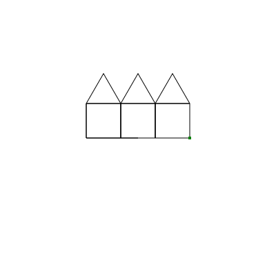

---
jupyter:
  jupytext:
    text_representation:
      extension: .md
      format_name: markdown
      format_version: '1.3'
      jupytext_version: 1.13.8
  kernelspec:
    display_name: Python 3
    language: python
    name: python3
---

# Eine Einführung in die Informatik mit Hilfe von Turtle Grafiken 

Eine zentrale Aufgabe in der Informatik besteht darin mit einem Computer oder
einem Roboter zu kommunizieren. Für uns sind sogenannte *Turtle Grafiken* sehr
nützlich, um die Grundlagen des Programmierens zu lernen. Sie haben
möglicherweise bereits ähnliche Konzepte auf der Sekundarstufe 1 kennengelernt.

Bei *Turtle Grafiken* geht es darum einer Schildkröte Anweisungen zu geben. Die
Schildkröte führt dann diese Anweisungen aus.  Interessanter wird dies dadurch,
dass die Schildkröte ein Stift in der Hand hält und ihren Verlauf aufzeichnet.
Übliche Answiesungen sind dabei sich um um eine gewisse Distanz vorwärts zu
bewegen (forward) oder sich im Gegenuhrzeigersinn um einen gewissen Winkel zu
drehen (rotate). Mit nur diesen Zwei Instruktionen, lassen sich bereits viele
interessante Grafiken generieren:


## Jupyter Notebooks

Das Dokument, dass Sie gerade anschauen, nennt man **Jupyter Notebook**. Das
ist ein interaktives Dokument, welches Python Code ausführen kann. In Jupyter
Notebooks gibt es sogenannte **Zellen** (**Cells**). Dies sind Textblöcke, die
verschiedene Funktionen haben können. Zum Beispiel lesen Sie gerade eine **Text
Zelle**. Eine solche Zelle zeigt bloss Text an. Daneben gibt es auch **Code
Zellen**. Der Text in solchen Zellen wird vom Computer  interpretiert und
ausgeführt.

Um Code in einer code Zelle auszuführen, wählen wir die entsprechende Zelle aus
(=drauf klicken). Wenn die Zelle ausgewählt ist erscheint oben auf der Seite
ein Knopf mit der Beschriftung `Run`. Wenn Sie diesen Knopf drücken, wird die
aktuelle Zelle ausgeführt. Alternativ können Sie auch die Zelle auswählen und
mit `ctrl`+`Enter` ausführen.

<!-- #region -->
### Ein erstes Beispiel
Dies ist das erste Programm, dass wir ausführen werden:
```python
from gymmu.turtle import *

make_turtle()

forward(50)
turn(60)
forward(100)

show()
```
<!-- #endregion -->

## Die Struktur des Codes

Damit der Computer unsere Instruktionen verstehen kann, müssen wir den Code auf
einer ganz spezifische Art schreiben. Man nennt dies **syntax**. Zum Beispiel
haben alle code Zellen auf dieser Seite einen sogenannten **header**, den wir
am Anfang hinschreiben.

`from gymmu.turtle import *`

> Dies lädt alle nötigen Befehle, die wir brauchen, um Turtle Grafiken zu erstellen.

`make_turtle()`

> Dies generiert eine neue Schildkröte.

Zum Schluss, nach allen unseren Instruktionen, führen wir den folgenden Befehl aus:

`show()`

> zeichnet die Grafik, die die Schildkröte generiert hat. Dies kann auch
> benutzt werden, um die aktuelle Position der Schuldkröte darzustellen.  Dies
> ist nützlich, wenn Sie nach Fehlern in ihrem Code suchen.

Text mit einem  'hashtag' am Anfang ist ein Kommentar.

`# Das ist ein Kommentar`

> Dieser Text wird vom Computer ignoriert, ist aber für uns sichtbar.
> Kommentare erlauben es uns zu erklären, was gewisse Zeilen oder ganze Blöcke
> von Code tun. Bei Arbeiten in Gruppen ist dies sehr nützlich.


## Erste Schritte

Wir beginnen mit zwei Grundbefehlen: `forward` and `turn`. Wir werden mit der
Zeit immer mehr und mehr Befehle kennenlernen. Dies erlaubt es uns dann
komplexere Bilder effizienter zu zeichnen. 

`forward(x)`
> Bewegt die Schildkröte um 'x' Pixel gerade aus. Beachten Sie, dass sich
> gerade aus auf die Blickrichtung der SChildkröte bezieht. Damit die
> Schildkröte sich rückwärts bewegt, geben Sie einfach eine negative Zahl ein.
> Rückwärtslaufen ändert die Blickrichtung der Schildkröþe nicht.

`turn(a)`
> Rotiert die Schildkröte um 'a' Grad im Gegenuhrzeigersinn. Sie können auch
> einen negativen Winkel verwenden.


### <span style="color: jungle green"> Beispiel </span>

```python
from gymmu.turtle import *

make_turtle()

forward(50)
# This moves the turtle 50 pixels forward.
turn(60)
# This rotates the turtle by 60 degrees in counter clockwise direction.
forward(100)
# This moves the turtle 100 pixels forward.

show()
```

### <span style="color: blue"> Exercise </span>
> Schauen Sie sich das obige Bild an. Wo ist die Schildkröte gestartet? Wo ist
> sie gestartet? In welche Richtung schaut die Schildkröte jetzt? 


## Jetzt sind Sie dran

Wir geben nun der Schildkröte einige Anweisungen. Sie finden unterhalb dieses
Textes ein Code Zelle. Diese Zelle beinhaltet bereits einigen Code. Also
könnnen wir diesen Code einfach ausführen und schauen was passiert.

```python
from gymmu.turtle import *

make_turtle()

color("blue")
forward(50)
turn(30)
forward(50)

show()
```

Nachdem Sie die Zelle ausgeführt haben sollten Sie einige kleine Linien und
eine kleine symbolische Repräsentation der Schildkröte. Das ist das Resultat
der Anweisungen, die wir der Schildkröte gegeben haben.

Sie können die Anweisungen von Zeilen 5 bis 7 abändern und schauen was
passiert. Sie müssen dann den Block allerdings neu ausführen, damit sie das
Ergebnis sehen können.

Selbstverständlich können Sie auch zusätzliche Anweisungen hinzufügen, in dem
Sie einfach neue Zeilen hinzufügen. Wenn Sie damit spielen können Sie versuchen
ein Rechteck oder komplexere Formen, wie ein Dreieck, zu zeichnen.

### <span style="color: blue"> Übung </span>
> Spielen Sie mit der Schildkröte. Können Sie diese dazu bringen das Bild zu
> verlassen? Wie weit kann sie laufen, bis sie den Rand erreicht?

## Fehler machen/debuggen

Ein Vorteil beim Programmieren von Turtle-Grafiken, besteht darin, dass man
genau sehen kann was man gerade tut. Es ist leicht ein paar neue Anweisungen
anzugeben und zu kontrollieren, ob diese Anweisungen korrekt sind. Das ist sehr
wichtig und sollte oft gemacht werden. Denn so kann man Fehler in frühzeitig
erkennen. Probiert man ein Programm erst nach hunderten von Zeilen aus, kann es
sehr schwierig werden, Fehler zu finden.

<!-- It is also very common to make small errors in your code, and the code does not -->
<!-- work as you intended. So it is also very important to understand what is -->
<!-- happening here. -->

Als Erstes sollten Sie wissen, dass es etwas gibt, dass **syntax** heisst. Eine
**syntax** definiert wie eine Sprache gelesen werden kann. Da Computer nur sehr
präzise und pedantisch formulierte Anweisungen befolgen kann, ist es sehr
wichtig sie eine korrekte Syntax zu verwenden. Sobald ein Wort, eine Klammer
oder sonst ein Zeichen falsch ist, kann der Computer das Programm nicht mehr
ausführen. Wenn Sie obigen Code etwas genauer anschauen, können Sie erkennen,
dass die Zahlen nach den Befehlen `forward` und `turn` in Klammern `()`
geschrieben werden. Das ist Teil der **Syntax** und ist für den Computer
wichtig. Sie können ausprobieren, was passiert, wenn man die Klammern weglässt.

Ein anderer Fehlertyp sind **semantische** Fehler. Ein **sematischer** Fehler
führt nicht zu einem Absturz des Programms. Das Programm macht aber nicht das,
was Sie eigentlich wollten. Fehler der **Semantik** sind sehr häufig und es
kann manchmal sehr schwierig sein, diese zu korrigieren. Um einen solchen zu
erkennen und zu korrigieren müssen Sie das Programm komplett verstanden haben.

Da wir den obigen Code noch nicht im Detail besprochen haben, ist passieren
**semantische** Fehler sehr schnell. Zum Beispiel könnten wir eine Anweisung
nach der Zeile `show()` hinzufügen. Dies würde keine Fehlermeldung erzeugen.
Trozdem wüëde sich das Bild nicht ändern. Wir möchten, dass die Schildkröte
alle Anweisungen ausführt und erst dann soll das Bild gezeigt werden. Wenn wir
nach der Zeile `show()` hinzufügen, werden diese nicht mehr gezeichnet. Sie
können dies selber ausprobieren.


Sie können den analogen **semantischen** Fehler machen, wenn Sie Anweisungen
vor der Zeile mit `make_turtle()` einfügen. Sie können das auch selber
ausprobieren.

Der Prozess, dass man den Code durchgeht und versucht die Fehler zu finden
nennt man **debuggen** und kann schwierig sein, vor allem wenn Sie viele Zeilen
Quellcode haben. Versuchen Sie in so einem Fall den Fehler einzugrenzen indem
Sie schauen welche Teile funktionieren und welche nicht.

## Mehr Anweisungen

Um etwas komplexere Bilder zu generieren, benötigen wir mehr mögliche
Anweisungen für die Schildkröte. Wie in der Informatik üblich, sollten die Bezeichnungen der folgenden Anweisungen ziemlich selbst erklärend sein. Daher sei hier nur eine Liste von Befehlen, ohne zu erklären was diese genau tun.

- `pen_up()`
- `pen_down()`
- `clear()`
- `reset()`
- `color('black')`
- `stroke_width(2)`

Just below this, you can find another code cell, where you can play around with
the new commands. This is a common scenario in Computer Science, where you have
to build the intuition for the behavior of the code.

```python
from gymmu.turtle import *

make_turtle()

# TODO: add your instructions here!

show()
```

### A Brief note on Colors
Colors are created in our brains when light of different wavelangths hit our retinas. There we (normally) have three diifferent types of receptors that can each recognize a different basic color (red, green or blue). Every color is therefore a combination of these three basic (or primary) colors.

IIf we only want a few different colors, we can use the predfined colors in the browser. A full list of the predefined colors can be found here: https://www.w3schools.com/colors/colors_names.asp

If we need different colors or want a specific shade we have to use an RGB (for red, green and blue) value. This is usually written as a six-digit **hexcode** (e.g. `#00FF00` or `#A01BC9`). We will look at these in more detail later. For now just note that the first two digits tell us how much red, the second two digits tell us how much green and the third two digits tell us how much blue to include.


### <span style="color: blue"> Exercise </span>
> Draw a picture  of a house using the commands you learned above. You can use the code block below.

```python
from gymmu.turtle import *

make_turtle()

# Your code goes here

show()
```

### <span style="color: jungle green"> Example </span>
Let's take a look at the following code:

```python
from gymmu.turtle import *

make_turtle()

pen_up()
forward(-170)
pen_down()

forward(50)
turn(90)
forward(50)
turn(90)
forward(50)
turn(90)
forward(50)
turn(90)

pen_up()
forward(150)
pen_down()

forward(50)
turn(90)
forward(50)
turn(90)
forward(50)
turn(90)
forward(50)
turn(90)

pen_up()
forward(150)
pen_down()

forward(50)
turn(90)
forward(50)
turn(90)
forward(50)
turn(90)
forward(50)
turn(90)

show()
```

This result was achieved by copying and pasting the code blocks multiple times to get the desired result of three squares. Looking at the code, we can see that it is quite long and seems a bit unwieldy. Also for example if we wanted to change the squares into triangles, we would have to change each block by hand. 

This seems ineffiecient. In fact there are many tricks and techniques that will allow us to make these drawings more quickly and with more adaptabiliity.

<!-- #region -->
## Shortcuts (Functions)

In computer science shortcuts are a way of reusing code multiple times. For 'reasons' these aren’t called shortcuts but **functions**. Functions are a computers way of saving a sequence of commands that can be reused later.

In python functions have the following structure

```python
def name():
    instructions
    instructions
    instructions
```
It is important the the instructions are indented in this manner (The exact number of spaces is not important, but they all have to be indented by the same amount). Use the tab key to indent by four spaces automatiically.

Using this idea of a shortcut (or function) we can now write the code above as follows:
<!-- #endregion -->

```python
from gymmu.turtle import *

def draw_square():
    forward(50)
    turn(90)
    forward(50)
    turn(90)
    forward(50)
    turn(90)
    forward(50)
    turn(90)

make_turtle()

pen_up()
forward(-170)
pen_down()

draw_square()

pen_up()
forward(150)
pen_down()

draw_square()

pen_up()
forward(150)
pen_down()

draw_square()

show()
```

This code is already much more readable and structured. We can now use this square drawing function to draw many different piictures.

```python
from gymmu.turtle import *

def draw_square():
    forward(50)
    turn(90)
    forward(50)
    turn(90)
    forward(50)
    turn(90)
    forward(50)
    turn(90)

make_turtle()

color('aquamarine')

draw_square()
turn(60)
draw_square()
turn(60)
draw_square()
turn(60)
draw_square()
turn(60)
draw_square()
turn(60)
draw_square()
turn(60)


show()
```

### <span style="color: blue"> Exercise </span>
> Write a function that draws an equilateral triangle with sides 50. Use this function to make some nice patterns.


### <span style="color: jungle green"> Example </span>
Let's look at the following code and image:

```python
from gymmu.turtle import *

def draw_square_50():
    forward(50)
    turn(90)
    forward(50)
    turn(90)
    forward(50)
    turn(90)
    forward(50)
    turn(90)
    
def draw_square_100():
    forward(100)
    turn(90)
    forward(100)
    turn(90)
    forward(100)
    turn(90)
    forward(100)
    turn(90)
    
def draw_square_75():
    forward(75)
    turn(90)
    forward(75)
    turn(90)
    forward(75)
    turn(90)
    forward(75)
    turn(90)

make_turtle()

pen_up()
forward(-170)
pen_down()

draw_square_50()

pen_up()
forward(100)
pen_down()

draw_square_100()

pen_up()
forward(150)
pen_down()

draw_square_75()

show()
```

Again, there must be an easier way to draw the same shape in three different sizes...

<!-- #region -->
## Parameters
A **parameter** is a number that is given when calling a function. It is also sometimes called the **argument** of the function:
```python
def name(a):
    instructions
    instructions
    instructions
```
Here the `a` is a parameter of the function `name` and we can call the function `name` with different values of `a`.
<!-- #endregion -->

```python
from gymmu.turtle import *

def draw_square(a):
    forward(a)
    turn(90)
    forward(a)
    turn(90)
    forward(a)
    turn(90)
    forward(a)
    turn(90)


make_turtle()

pen_up()
forward(-170)
pen_down()

draw_square(50)

pen_up()
forward(100)
pen_down()

draw_square(100)

pen_up()
forward(150)
pen_down()

draw_square(75)

show()
```

Much better! Here the `a` stands for the length of the sides of the squares and can be changed every time we call the function `draw_square`.

<!-- #region -->
## Repeating Commands (Loops)

You may have noticed that in the example above the function just contains multiple repetitions of the sequence
```python
forward(50)
turn(90)
```
As before there is an elegant way for writing this code in a shorter fashion. IIn this case we call these **loops**. A loop in computer science is a set of commands that is executed until a specific condition is met.

In python loops are defined as follows:
```python
for i in range(n):
    instructions
    instructions
    instructions
```
Here there will be n repetitions of the commands defined in the instructions. Usinig this we can now shorten our code from above even more (please note the double indentation):
<!-- #endregion -->

```python
from gymmu.turtle import *

def draw_square(a):
    for i in range(4):
        forward(a)
        turn(90)

make_turtle()

pen_up()
forward(-170)
pen_down()

draw_square(50)

pen_up()
forward(150)
pen_down()

draw_square(50)

pen_up()
forward(150)
pen_down()

draw_square(50)

show()
```

We can go even further and use the for loop a second time:

```python
from gymmu.turtle import *

def draw_square(a):
    for i in range(4):
        forward(a)
        turn(90)

make_turtle()

pen_up()
forward(-170)
pen_down()

for i in range(3):
    draw_square(50)

    pen_up()
    forward(150)
    pen_down()

show()
```

We can go even further with the idea of shortening our code using functions. Basically, any time we use the same or simiilar code multiple times it may be useful to write a function:

```python
from gymmu.turtle import *

def draw_square(a):
    for i in range(4):
        forward(a)
        turn(90)

def jump(b):
    pen_up()
    forward(b)
    pen_down()
        
make_turtle()

jump(-170)

for i in range(3):
    draw_square(50)
    jump(150)

show()
```

### <span style="color: blue"> Exercise </span>
> Why is the turtle no longer visible in the last image?


### <span style="color: blue"> Exercise </span>
> Write a function that takes a parameter 'n' and draws a regular polygon with n sides of length 50. (A square is a regular polygon with 4 sides etc.)
>
> Additional exercise: Allow the function to take an additional parameter defining the length of the sides.


### <span style="color: blue"> Exercise </span>
> Write a function draw_triangle() and a function draw_square() to create the following image:
> 

<!-- #region -->
## Random Walks
Randomness is an important concept in computer science and we will look into it more deeply later. However, for the moment we can use built in random generators to create images and patterns.

The python command `randint(a,b)` takes two integers a and b as the input and gives a random number between a and b (both included) as the output. In order to use the command we have to import it from a so called 'library'.:
```python
from random import randint
```
Below you can see an example of a random walk. In each step the direction of the turtle is randomly chosen between up, down, left or right. Then the turtle moves 15 pixels in that direction.
<!-- #endregion -->

### <span style="color: jungle green"> Example </span>

```python
from gymmu.turtle import *
from random import randint

make_turtle()

for i in range(300):
    turn(randint(0,3)*90)
    forward(15)


show()
```

```python
from gymmu.turtle import *
from random import randint

make_turtle()

for i in range(300):
    x=randint(1,3)
    turn(x*90)
    forward(15)


show()
```

We can now use this idea to draw some random squares

```python
from gymmu.turtle import *
from random import randint

def draw_square(a):
    for i in range(4):
        forward(a)
        turn(90)

def jump(b):
    pen_up()
    forward(b)
    pen_down()
        
make_turtle()

jump(-170)

for i in range(3):
    x=randint(1,5)
    draw_square(x*10)
    jump(150)

show()
```
